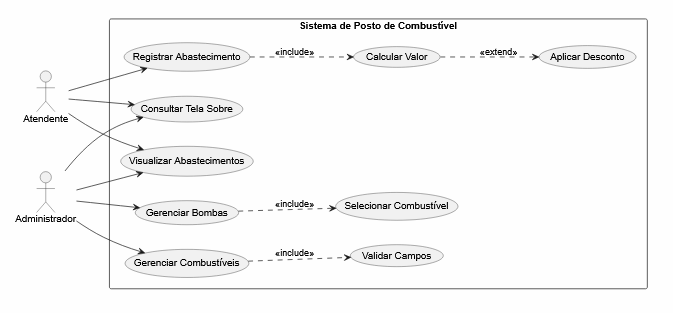
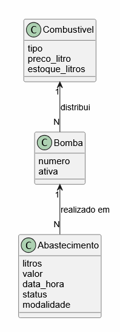
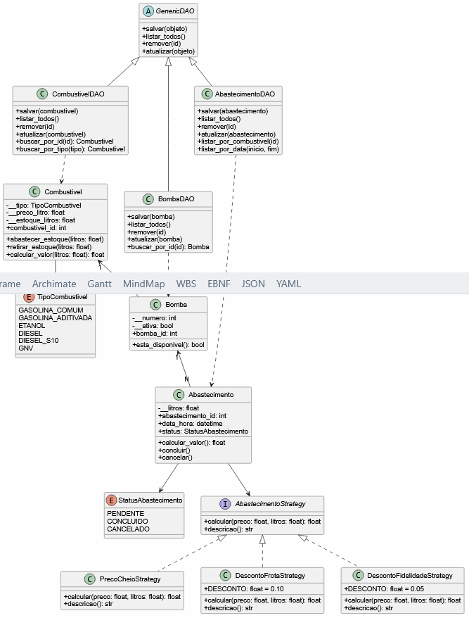
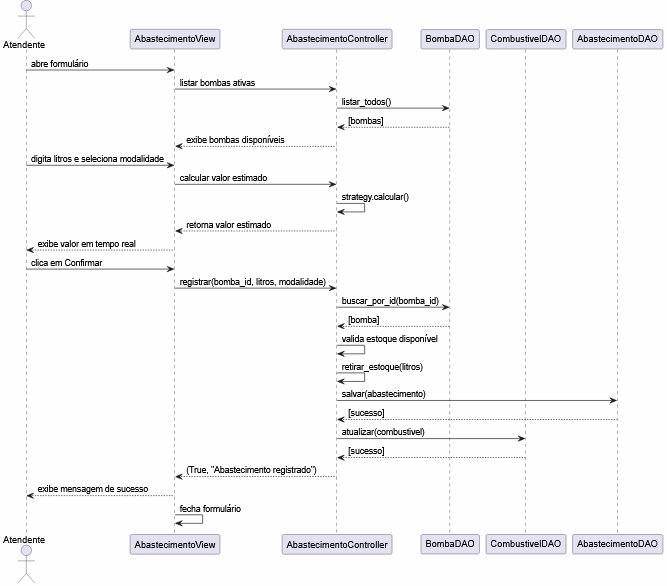

# Documentação do Projeto — Sistema de Posto de Combustível

**Disciplina:** Análise e Projeto de Sistemas (APS)  
**Professores:** Mateus de Freitas Invernisi e Vanessa Lago Machado  
**Aluno:** Gabriel Duarte Barboza  
**Curso:** Bacharelado em Ciência da Computação — IFSul  
**Período:** 2026/1  

---

## Sumário

1. [Descrição e Delimitação do Escopo](#1-descrição-e-delimitação-do-escopo)
2. [Fase de Análise](#2-fase-de-análise)
   - [Requisitos Funcionais](#a-requisitos-funcionais)
   - [Requisitos Não Funcionais](#b-requisitos-não-funcionais)
   - [Regras de Negócio](#c-regras-de-negócio)
   - [Diagrama de Casos de Uso](#e-diagrama-de-casos-de-uso)
   - [Documentação dos Casos de Uso](#f-documentação-dos-casos-de-uso)
   - [Diagrama de Classes — Modelo Conceitual](#g-diagrama-de-classes--modelo-conceitual)
3. [Fase de Projeto](#3-fase-de-projeto)
   - [Diagrama de Classes](#a-diagrama-de-classes)
   - [Diagrama de Sequência](#b-diagrama-de-sequência)
4. [Considerações Finais](#4-considerações-finais)
5. [Referências](#5-referências)

---

## 1. Descrição e Delimitação do Escopo

### Cenário do Sistema

O **Sistema de Posto de Combustível** é uma aplicação desktop desenvolvida para auxiliar na gestão operacional de um posto de combustível de pequeno ou médio porte. O sistema foi desenvolvido como projeto integrador das disciplinas de Análise e Projeto de Sistemas (APS) e Linguagem de Programação Orientada a Objetos (LPOO).

**Propósito:** Automatizar e centralizar o controle de combustíveis, bombas de abastecimento e registros de abastecimentos, substituindo controles manuais em papel ou planilhas dispersas.

**Contexto de uso:** O sistema é operado por atendentes e administradores do posto durante o expediente. O atendente registra os abastecimentos no momento em que ocorrem, enquanto o administrador gerencia o cadastro de combustíveis e bombas e acompanha os registros.

**Público-alvo:** Funcionários operacionais (atendentes) e gestores (administradores) de postos de combustível.

**Problema que o sistema resolve:**
- Controle impreciso de estoque de combustível
- Falta de registro histórico dos abastecimentos realizados
- Dificuldade em aplicar diferentes modalidades de preço (preço cheio, desconto frota, desconto fidelidade)
- Ausência de visibilidade sobre quais bombas estão ativas e com estoque disponível

**Funcionalidades contempladas:**
- Cadastro e gerenciamento de tipos de combustível com preço e estoque
- Cadastro e gerenciamento de bombas de abastecimento
- Registro de abastecimentos com cálculo automático de valor
- Controle automático de estoque a cada abastecimento
- Listagem e filtro de abastecimentos por combustível
- Suporte a três modalidades de precificação via padrão Strategy

**Fora do escopo:**
- Controle financeiro e caixa do posto
- Cadastro de clientes ou veículos
- Emissão de notas fiscais
- Integração com sistemas externos

---

## 2. Fase de Análise

### a) Requisitos Funcionais

| ID | Descrição |
|---|---|
| RF01 | O sistema deve permitir cadastrar um novo tipo de combustível informando tipo, preço por litro e estoque inicial |
| RF02 | O sistema deve permitir editar o preço por litro e o estoque de um combustível já cadastrado |
| RF03 | O sistema deve permitir remover um combustível, desde que não haja bombas vinculadas a ele |
| RF04 | O sistema deve listar todos os combustíveis cadastrados com tipo, preço por litro e estoque atual |
| RF05 | O sistema deve permitir cadastrar uma bomba informando número, combustível associado e status (ativa/inativa) |
| RF06 | O sistema deve permitir editar os dados de uma bomba, incluindo troca de combustível e alteração de status |
| RF07 | O sistema deve permitir remover uma bomba, desde que não haja abastecimentos vinculados a ela |
| RF08 | O sistema deve permitir registrar um abastecimento selecionando a bomba, informando a quantidade de litros e escolhendo a modalidade de preço |
| RF09 | O sistema deve calcular e exibir automaticamente o valor estimado do abastecimento em tempo real conforme o usuário digita a quantidade de litros |
| RF10 | O sistema deve atualizar automaticamente o estoque do combustível ao concluir um abastecimento |
| RF11 | O sistema deve listar todos os abastecimentos registrados com bomba, combustível, litros, valor, modalidade, data/hora e status |
| RF12 | O sistema deve permitir filtrar os abastecimentos por tipo de combustível |
| RF13 | O sistema deve exibir apenas bombas ativas com estoque disponível no formulário de abastecimento |
| RF14 | O sistema deve oferecer três modalidades de precificação: Preço Cheio, Desconto Frota (10%) e Desconto Fidelidade (5%) |
| RF15 | O sistema deve exibir uma tela Sobre com informações do sistema e do autor |

---

### b) Requisitos Não Funcionais

| ID | Descrição |
|---|---|
| RNF01 | **Usabilidade:** A interface deve ser intuitiva, com menus de navegação claros e mensagens de erro compreensíveis ao usuário |
| RNF02 | **Desempenho:** O sistema deve responder a qualquer ação do usuário em até 2 segundos em condições normais de uso |
| RNF03 | **Persistência:** Todos os dados devem ser persistidos em banco de dados PostgreSQL, garantindo que nenhuma informação seja perdida ao fechar o sistema |
| RNF04 | **Manutenibilidade:** O código deve seguir a arquitetura MVC e utilizar padrões de projeto (DAO e Strategy), facilitando manutenção e extensão futura |
| RNF05 | **Validação:** O sistema deve validar todos os campos obrigatórios e tipos de dados antes de salvar qualquer informação, exibindo mensagens de erro específicas |
| RNF06 | **Portabilidade:** O sistema deve funcionar em qualquer computador com Python 3.13+, PostgreSQL 18 e a biblioteca psycopg instalada |
| RNF07 | **Integridade:** O banco de dados deve garantir integridade referencial por meio de chaves estrangeiras, impedindo exclusão de registros com dependências |

---

### c) Regras de Negócio

| ID | Descrição |
|---|---|
| RN01 | Um abastecimento só pode ser registrado se a bomba selecionada estiver ativa e possuir estoque suficiente para a quantidade de litros solicitada |
| RN02 | Ao concluir um abastecimento, o sistema deve descontar automaticamente a quantidade de litros abastecida do estoque do combustível vinculado à bomba |
| RN03 | Não é permitido cadastrar dois combustíveis do mesmo tipo (ex.: duas entradas de Gasolina Comum) |
| RN04 | O preço por litro de um combustível deve ser sempre maior que zero |
| RN05 | O estoque de um combustível não pode ser negativo em nenhuma situação |
| RN06 | A modalidade de preço define o valor cobrado por litro: Preço Cheio (sem desconto), Desconto Frota (10% de desconto) e Desconto Fidelidade (5% de desconto) |

---

### e) Diagrama de Casos de Uso

**Atores:**
- **Atendente:** Usuário operacional responsável por registrar os abastecimentos e consultar o histórico
- **Administrador:** Usuário gestor responsável pelo cadastro e manutenção de combustíveis e bombas

**Casos de Uso:**
- **UC01 — Gerenciar Combustíveis:** exclusivo do Administrador
- **UC02 — Gerenciar Bombas:** exclusivo do Administrador
- **UC03 — Registrar Abastecimento:** exclusivo do Atendente, inclui Calcular Valor que pode estender para Aplicar Desconto
- **UC04 — Visualizar Abastecimentos:** compartilhado entre Atendente e Administrador
- **UC05 — Consultar Tela Sobre:** compartilhado entre Atendente e Administrador

---

### f) Documentação dos Casos de Uso

---

#### UC01 — Gerenciar Combustíveis

| Campo | Descrição |
|---|---|
| **Nome** | Gerenciar Combustíveis |
| **Ator(es)** | Administrador |
| **Pré-condições** | O sistema está em execução e o banco de dados está acessível |
| **Pós-condições** | O combustível é cadastrado, editado ou removido no banco de dados |

**Fluxo Principal — Cadastrar:**
1. O Administrador acessa o menu Cadastro → Combustíveis
2. O sistema exibe a listagem de combustíveis cadastrados
3. O Administrador clica em "Novo"
4. O sistema exibe o formulário de cadastro
5. O Administrador seleciona o tipo, informa o preço por litro e o estoque inicial
6. O Administrador clica em "Salvar"
7. O sistema valida os dados e persiste no banco
8. O sistema exibe mensagem de sucesso e atualiza a listagem

**Fluxo Alternativo — Editar:**
1. O Administrador seleciona um combustível na listagem e clica em "Editar"
2. O sistema abre o formulário com os dados preenchidos
3. O Administrador altera os campos desejados e clica em "Salvar"
4. O sistema valida e atualiza o registro no banco

**Fluxo Alternativo — Remover:**
1. O Administrador seleciona um combustível e clica em "Remover"
2. O sistema exibe confirmação
3. O Administrador confirma
4. O sistema remove o registro e atualiza a listagem

**Fluxos de Exceção:**
- Se o tipo de combustível já estiver cadastrado, o sistema exibe mensagem de erro e cancela o cadastro
- Se o preço for zero ou negativo, o sistema exibe mensagem de validação
- Se houver bombas vinculadas, o sistema impede a remoção e exibe mensagem de erro

---

#### UC02 — Gerenciar Bombas

| Campo | Descrição |
|---|---|
| **Nome** | Gerenciar Bombas |
| **Ator(es)** | Administrador |
| **Pré-condições** | Existe pelo menos um combustível cadastrado no sistema |
| **Pós-condições** | A bomba é cadastrada, editada ou removida no banco de dados |

**Fluxo Principal — Cadastrar:**
1. O Administrador acessa o menu Cadastro → Bombas
2. O sistema exibe a listagem de bombas cadastradas
3. O Administrador clica em "Nova"
4. O sistema exibe o formulário com os combustíveis disponíveis
5. O Administrador informa o número da bomba, seleciona o combustível e define o status
6. O Administrador clica em "Salvar"
7. O sistema valida e persiste no banco
8. O sistema exibe mensagem de sucesso e atualiza a listagem

**Fluxo Alternativo — Editar:**
1. O Administrador seleciona uma bomba e clica em "Editar"
2. O sistema abre o formulário com os dados preenchidos
3. O Administrador altera os campos e salva

**Fluxo Alternativo — Remover:**
1. O Administrador seleciona uma bomba e clica em "Remover"
2. O sistema exibe confirmação e remove o registro

**Fluxos de Exceção:**
- Se o número da bomba for menor ou igual a zero, o sistema exibe mensagem de validação
- Se não houver combustíveis cadastrados, o Combobox estará vazio e o salvamento será bloqueado

---

#### UC03 — Registrar Abastecimento

| Campo | Descrição |
|---|---|
| **Nome** | Registrar Abastecimento |
| **Ator(es)** | Atendente |
| **Pré-condições** | Existe pelo menos uma bomba ativa com estoque disponível |
| **Pós-condições** | O abastecimento é registrado e o estoque do combustível é atualizado |

**Fluxo Principal:**
1. O Atendente acessa o menu Operações → Abastecimentos
2. O sistema exibe a listagem de abastecimentos
3. O Atendente clica em "Novo Abastecimento"
4. O sistema exibe o formulário com apenas as bombas ativas com estoque disponível
5. O Atendente seleciona a bomba, informa a quantidade de litros e escolhe a modalidade de preço
6. O sistema calcula e exibe o valor estimado em tempo real
7. O Atendente clica em "Confirmar Abastecimento"
8. O sistema valida o estoque disponível
9. O sistema registra o abastecimento e desconta os litros do estoque
10. O sistema exibe mensagem de sucesso e fecha o formulário
11. A listagem é atualizada automaticamente

**Fluxo Alternativo — Desconto:**
- Se o Atendente selecionar "Desconto Frota (10%)" ou "Desconto Fidelidade (5%)", o sistema recalcula o valor aplicando o percentual correspondente

**Fluxos de Exceção:**
- Se a quantidade de litros for maior que o estoque disponível, o sistema exibe mensagem de erro e cancela o registro
- Se a quantidade de litros for zero ou negativa, o sistema exibe mensagem de validação

---

#### UC04 — Visualizar Abastecimentos

| Campo | Descrição |
|---|---|
| **Nome** | Visualizar Abastecimentos |
| **Ator(es)** | Atendente, Administrador |
| **Pré-condições** | O sistema está em execução |
| **Pós-condições** | O usuário visualiza os abastecimentos conforme o filtro aplicado |

**Fluxo Principal:**
1. O usuário acessa o menu Operações → Abastecimentos
2. O sistema exibe todos os abastecimentos registrados na tabela
3. O usuário visualiza as informações de cada abastecimento

**Fluxo Alternativo — Filtrar por Combustível:**
1. O usuário seleciona um tipo de combustível no Combobox de filtro
2. O usuário clica em "Filtrar"
3. O sistema exibe apenas os abastecimentos do combustível selecionado
4. O usuário clica em "Limpar" para voltar à listagem completa

---

#### UC05 — Consultar Tela Sobre

| Campo | Descrição |
|---|---|
| **Nome** | Consultar Tela Sobre |
| **Ator(es)** | Atendente, Administrador |
| **Pré-condições** | O sistema está em execução |
| **Pós-condições** | O usuário visualiza as informações do sistema |

**Fluxo Principal:**
1. O usuário acessa o menu Ajuda → Sobre
2. O sistema exibe a tela com nome do sistema, versão, padrões de projeto utilizados e dados do autor
3. O usuário clica em "Fechar"

---

### g) Diagrama de Classes — Modelo Conceitual

**Entidades do domínio:**
- **Combustivel:** representa um tipo de combustível disponível no posto com seu preço e estoque
- **Bomba:** representa uma bomba de abastecimento vinculada a um tipo de combustível
- **Abastecimento:** representa um registro de abastecimento realizado em uma bomba

**Relacionamentos:**
- Bomba distribui um Combustivel (N para 1)
- Abastecimento é realizado em uma Bomba (N para 1)

---

## 3. Fase de Projeto

### a) Diagrama de Classes

**Padrões de projeto visíveis:**

**DAO (Data Access Object):** A classe abstrata `GenericDAO` define o contrato com os métodos `salvar()`, `listar_todos()`, `remover()` e `atualizar()`. As classes `CombustivelDAO`, `BombaDAO` e `AbastecimentoDAO` herdam de `GenericDAO` e implementam o acesso ao banco PostgreSQL, isolando completamente a persistência das demais camadas.

**Strategy:** A interface `AbastecimentoStrategy` define o contrato de cálculo de valor. As classes `PrecoCheioStrategy`, `DescontoFrotaStrategy` (10%) e `DescontoFidelidadeStrategy` (5%) implementam algoritmos diferentes de precificação. A classe `Abastecimento` recebe a estratégia como dependência e delega o cálculo a ela, sem precisar conhecer os detalhes de cada modalidade.

---

### b) Diagrama de Sequência

**Caso de Uso:** UC03 — Registrar Abastecimento

**Descrição do fluxo:**
1. O Atendente abre o formulário de abastecimento
2. A View solicita ao Controller a lista de bombas ativas
3. O Controller consulta o BombaDAO e retorna as bombas disponíveis
4. O Atendente digita os litros e seleciona a modalidade
5. A View aciona o Controller para calcular o valor em tempo real via Strategy
6. O Atendente confirma o abastecimento
7. O Controller valida o estoque, retira os litros do combustível, salva o abastecimento via AbastecimentoDAO e atualiza o estoque via CombustivelDAO
8. A View exibe a mensagem de sucesso e fecha o formulário

---

## 4. Considerações Finais

### Desafios Encontrados

**Conexão com o banco de dados no Windows:** O maior desafio técnico foi configurar a conexão com o PostgreSQL no Windows. A biblioteca psycopg2 apresentava um `UnicodeDecodeError` causado por caracteres especiais no caminho de instalação do sistema operacional. A solução foi migrar para o psycopg3, que não apresenta esse problema.

**Hierarquia de janelas no Tkinter:** Entender como estruturar janelas pai e filha usando `Toplevel` e `wait_window()` exigiu estudo cuidadoso da documentação. O desafio era garantir que a janela de listagem recarregasse os dados automaticamente após o fechamento do formulário filho.

**Cálculo em tempo real:** Implementar o cálculo do valor do abastecimento em tempo real, reagindo a cada tecla digitada pelo usuário, exigiu o uso do evento `<KeyRelease>` do Tkinter associado a uma função de atualização do label de valor estimado.

**Rastreabilidade entre análise e implementação:** Garantir que os requisitos, casos de uso, diagramas e o código estivessem todos coerentes entre si foi um exercício constante de revisão e ajuste ao longo do desenvolvimento.

### Aprendizados

- Compreendi como o padrão **Strategy** permite intercambiar algoritmos de cálculo sem modificar a classe principal, tornando o sistema extensível a novas modalidades de preço sem alterações no código existente
- Entendi como o padrão **DAO** isola completamente o acesso ao banco de dados, fazendo com que o restante do sistema seja independente da tecnologia de persistência
- Aprendi a importância da **modelagem conceitual** antes da implementação — ter os diagramas de classes e casos de uso definidos antecipadamente facilitou o desenvolvimento e reduziu retrabalho
- Vivenciei na prática o ciclo completo de desenvolvimento de software: análise de requisitos → modelagem UML → implementação → testes → documentação

### Melhorias Futuras

- Implementar relatório de faturamento por período com gráficos
- Adicionar cadastro de clientes e vinculação ao abastecimento para programa de fidelidade
- Criar módulo de reabastecimento de tanques com registro de fornecedores
- Adicionar autenticação de usuários com perfis distintos (Atendente e Administrador)
- Implementar exportação de relatórios em PDF ou Excel
- Adicionar painel de dashboard com indicadores em tempo real (estoque crítico, total abastecido no dia, etc.)

---

## 5. Referências

GUEDES, Gilleanes T. A. **UML 2: uma abordagem prática.** 2. ed. São Paulo: Novatec, 2011.

UML Diagrams. **UML 2.5 Diagrams Overview.** Disponível em: https://www.uml-diagrams.org. Acesso em: jun. 2026.

Python Software Foundation. **Tkinter — Python interface to Tcl/Tk.** Disponível em: https://docs.python.org/3/library/tkinter.html. Acesso em: jun. 2026.

Psycopg. **Psycopg 3 documentation.** Disponível em: https://www.psycopg.org/psycopg3/docs. Acesso em: jun. 2026.

PostgreSQL Global Development Group. **PostgreSQL 18 Documentation.** Disponível em: https://www.postgresql.org/docs/18. Acesso em: jun. 2026.

PlantUML. **PlantUML — Open-source tool for UML diagrams.** Disponível em: https://plantuml.com. Acesso em: jun. 2026.

---

**Ferramenta utilizada para os diagramas:** PlantUML (https://plantuml.com)

**Declaração de uso de IA:**
- **Ferramenta:** Claude Sonnet 4.6 (Anthropic)
- **Etapas em que foi utilizada:** auxílio na configuração da conexão com PostgreSQL no Windows, geração de código boilerplate para as camadas DAO, Controller e View, e apoio na estruturação dos artefatos de documentação
- **Aprendizado com o uso:** o uso da IA acelerou a resolução de problemas técnicos específicos, mas exigiu leitura e compreensão de todo o código gerado antes de incorporá-lo ao projeto, reforçando a importância de entender o que se está implementando
